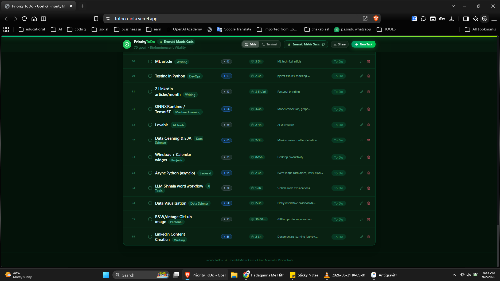

# 🎯 Priority ToDo — Smart Goal & Priority Management Matrix

A modern, high-performance **Priority-Driven To-Do & Execution Matrix** web application built with **React 19**, **TypeScript**, **Tailwind CSS v4**, and **Vite**.

Designed with **Apple (macOS & iOS) minimalist aesthetics**, **5 story-driven thematic environments**, **real-time cross-device cloud synchronization** (phone & laptop), **GitHub as a Database**, and **direct Supabase integration without a backend**.



---

## 🌐 Live Demo

**[totodo-iota.vercel.app](https://totodo-iota.vercel.app)**

> No installation needed — open the link on any device and start managing your goals instantly.

---

## 📥 Download & Installation

### Option 1: Use Online (No Download)

Simply visit **[totodo-iota.vercel.app](https://totodo-iota.vercel.app)** in any modern browser (Chrome, Firefox, Safari, Edge). Works on both desktop and mobile.

### Option 2: Download & Run Locally

#### Prerequisites
- **[Node.js](https://nodejs.org/)** v18 or later
- **npm** (comes with Node.js) or **yarn**
- **Git** ([download here](https://git-scm.com/downloads))

#### Step-by-step

```bash
# 1. Clone the repository
git clone https://github.com/aroshwijesinghe/ToDo.git

# 2. Navigate into the project folder
cd ToDo

# 3. Install all dependencies
npm install

# 4. Start the development server
npm run dev
```

Open **`http://localhost:5173`** in your browser — the app is now running locally! 🎉

#### Build for Production

```bash
# Create an optimized production build
npm run build

# Preview the production build locally
npm run preview
```

### Option 3: Download as ZIP (No Git Required)

1. Go to **[github.com/aroshwijesinghe/ToDo](https://github.com/aroshwijesinghe/ToDo)**
2. Click the green **"Code"** button → **"Download ZIP"**
3. Extract the ZIP file
4. Open a terminal in the extracted folder
5. Run `npm install` then `npm run dev`

---

## 🧠 How It Works

### Architecture Overview

```
┌─────────────────────────────────────────────────────────┐
│                    Browser (Frontend)                    │
│  React 19 + TypeScript + Tailwind CSS v4 + Vite         │
│                                                         │
│  ┌─────────────┐  ┌──────────────┐  ┌───────────────┐  │
│  │ Task Matrix  │  │ Theme Engine │  │ Sync Manager  │  │
│  │ (CRUD ops)   │  │ (5 themes)   │  │ (SSE + BCS)   │  │
│  └──────┬───────┘  └──────────────┘  └───────┬───────┘  │
│         │                                     │         │
└─────────┼─────────────────────────────────────┼─────────┘
          │                                     │
          ▼                                     ▼
┌──────────────────┐              ┌──────────────────────┐
│  GitHub REST API │              │  Supabase (Postgres)  │
│  data/tasks.json │              │  Direct from browser  │
└──────────────────┘              └──────────────────────┘
```

### How Tasks Work

1. **Create a Task** → Click **"+ New Task"** button → Fill in title, priority (0-100), estimated time, category, and description.
2. **Priority Scoring** → Each task gets a weighted activity score calculated by `Priority × Duration (in hours)` — higher priority + longer tasks rise to the top.
3. **Status Tracking** → Track tasks through three states: **To Do** → **In Progress** → **Completed** (with confetti celebration! 🎊).
4. **Edit & Delete** → Click the ✏️ pencil icon to edit or the 🗑️ trash icon to delete any task.

### How Cross-Device Sync Works

1. **Create a Sync Room** → Choose a memorable room name (e.g., `arosh`).
2. **Connect from Any Device** → Open the app on your phone/laptop and enter the same room name.
3. **Instant QR Code Pairing** → Or simply scan the QR code displayed on your desktop with your phone camera.
4. **Real-Time Updates** → Changes propagate across all connected devices in under 200ms via **Server-Sent Events (SSE)**.
5. **Multi-Tab Support** → Even works across multiple browser tabs using the **BroadcastChannel API**.

### How Data Storage Works

You have two options for persisting your tasks:

| Feature | GitHub (Option A) | Supabase (Option B) |
| :--- | :--- | :--- |
| **Storage** | `data/tasks.json` in your repo | PostgreSQL database |
| **Cost** | Free forever | Free tier available |
| **History** | Full Git commit history | Database records |
| **Backend** | No backend needed | No backend needed |
| **Setup** | GitHub token only | Supabase URL + API key |

### How Themes Work

Switch between **5 immersive thematic environments** via the theme selector. Each theme changes:
- Background colors & gradients
- Card glass effects & borders
- Accent colors for badges & buttons
- An ambient story tagline for the environment

---

## 🌟 Key Highlights & Features

### 1. 🍎 Apple Minimalist Design System
- **Frosted Glass & Depth**: Translucent cards with `backdrop-blur-2xl`, micro-borders, and dynamic ambient glow cones.
- **Weighted "toDo" Activity Card**: Progress calculated dynamically by $(\\text{Priority} \\times \\text{Duration in Hours})$ with traveling light shimmer animations.
- **iOS Segmented Controls & Micro-Interactions**: Smooth spring checkboxes, customizable priority heat badges, and elevation lift on hover.
- **Mobile-First Experience**: Automatically adapts on phones into touch-friendly **Mobile Cards** and an **iOS Bottom Sheet Modal** with a floating action button (FAB).

---

### 2. 🎨 5 Story-Driven Thematic Worlds

Switch between 5 distinct environments, each with tailored matching palettes for backgrounds, component cards, borders, and story taglines:

| Theme | World Name | Story & Vibe | Accent & Palette |
| :--- | :--- | :--- | :--- |
| 🌌 **Dark** | **Deep Space Void** | *Zero-gravity engineering focus beneath a star-filled cosmos.* | Obsidian Glass (`#09090b` / `#141418`) with Starlight Emerald (`#10b981`) |
| ❄️ **White** | **Ceramic Snow Peak** | *Crisp Alpine morning clarity for distraction-free execution.* | Ceramic Alabaster (`#f5f5f7` / `#ffffff`) with Sapphire Blue (`#0284c7`) |
| 🔮 **Purple** | **Neon Cyber Nebula** | *Electric violet lasers slicing through an endless Tokyo nightscape.* | Velvet Midnight (`#0c0717` / `#180e2b`) with Neon Violet (`#a855f7`) |
| 🌲 **Green** | **Emerald Matrix Oasis** | *A bioluminescent cyber-forest where digital lines sprout.* | Forest Abyss (`#041209` / `#0a2314`) with Matrix Green (`#22c55e`) |
| 🌅 **Warm** | **Solar Flare Sunset** | *Warm amber coastal rays, roasted coffee, and golden momentum.* | Espresso Ember (`#140b05` / `#24140a`) with Tangerine Gold (`#f97316`) |

---

### 3. ☁️ Real-Time Cross-Device & Multi-Tab Synchronization
- **Zero Data Loss Guarantee**: Local-first architecture stores data safely on your device first.
- **Real-Time Pub/Sub with Server-Sent Events (SSE)**: Synchronizes changes across **Phones**, **Laptops**, and **Incognito / Private Tabs** in $<200\\text{ms}$ without refreshing.
- **Instant QR Code Pairing**: Scan the QR code with your phone camera to open and link your tasks instantly.
- **Memorable Sync Rooms**: Choose any name (e.g. `arosh`) to connect across devices.

---

### 4. 🗄️ Multi-Backend Database Support

#### 🐙 Option A: GitHub as a Database (`data/tasks.json`)
- Automatically commits any task changes directly to `data/tasks.json` in your GitHub repository via the GitHub REST API.
- 100% file-based, permanent commit history, and completely free forever.

#### ⚡ Option B: Supabase (Direct from Frontend — No Backend Needed!)
- Connect directly to your private **Supabase PostgreSQL database** using your Project URL and Anon API key without running any Node/Python backend servers.

---

## 📋 Task Matrix Data Schema

Every task is organized under the engineering priority matrix format:

```typescript
interface TodoTask {
  id: string;
  rank: number;       // Execution sequence (e.g., 01, 02, 03)
  task: string;       // Goal / Objective title
  pri: number;        // Priority score (0 - 100)
  time: string;       // Estimated duration (e.g. "3-4h", "30-60m")
  description: string;// Core technical summary
  status: 'todo' | 'in-progress' | 'completed';
  category?: string;  // DevOps, Machine Learning, Backend, etc.
  createdAt: string;
  completedAt?: string;
}
```

---

## ⚡ Deployment (Vercel Ready)

This repository includes a pre-configured `vercel.json` for single-page routing and caching:

1. Push your repository to GitHub.
2. Sign in to [Vercel](https://vercel.com) and click **"Add New..." ➔ "Project"**.
3. Select **`aroshwijesinghe/ToDo`** and click **Deploy**.

---

## 🛠️ Tech Stack

- **Framework**: React 19 + TypeScript + Vite
- **Styling**: Tailwind CSS v4 + Lucide React Icons
- **Real-Time Sync**: Server-Sent Events (SSE) + Browser BroadcastChannel API
- **Animations**: Canvas Confetti + CSS Keyframe Shimmer Animations
- **Hosting**: Vercel Serverless Edge

---

## 📄 License
MIT License © 2026 Arosh Wijesinghe
